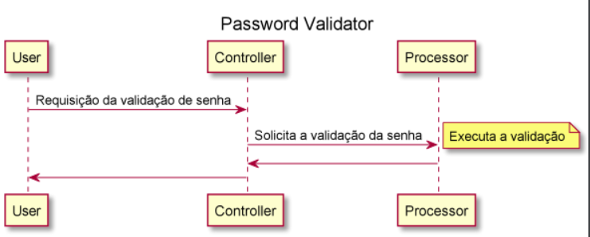

# Projeto Password Validator

### 🛠 Tecnologias

- Java 11.
- Build: Gradle 2.4.3.
- Kotlin.
### Fluxo

### Executando a aplicação
- Para executar a api basta entrar na pasta raiz do projeto executar o comando:
> ./gradlew bootRun
> 
- Apos rodar o comando, aguardar a mensagem informando que a JVM 
  foi iniciada conforme exemplo abaixo, para iniciar a execução das chamadas no end point.
>Started PasswordValidatorApplicationKt in 3.84 seconds (JVM running for 4.666)

-Efetuar a chamada no endpoint abaixo passando a senha desejada.
>localhost:8080/api/password/validatePassword/?password

### Detalhes sobre a aplicação
- A solução utilizada contem Controller e Processor:

####Controller
> É o responsavel por receber a requisição com a senha e tratar a resposta Http conforme o retorno do processor. 

####Processor
> É o responsavel pela regra de validação da senha retornando um boolean se a senha é valida com true ou não é valida com false.

